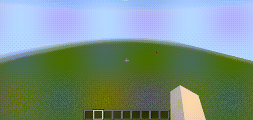
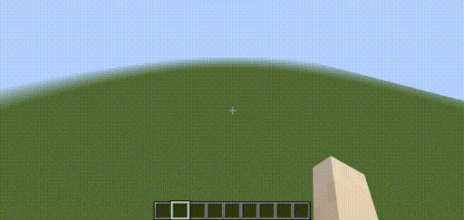
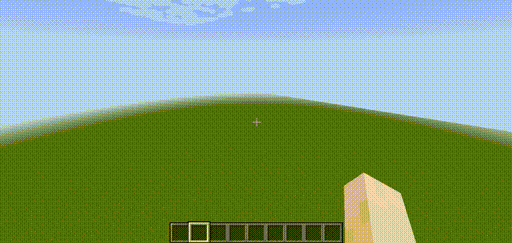

evocraft-ga
================
## (WIP) more algorithms / models coming soon
## Exploring deep genetic algorithms in Minecraft using https://github.com/real-itu/Evocraft-py

## Examples
1. Generating random cube structures with DNN using NS-GA (Novelty Search Genetic Algorithm) [code](evocraft_ga/generate_cubes.py)

- Neural Networks are optimized by "novelty" measured by the the distance between the structure generated to the structures saved in the Novelty Search cache.
- Every generation, the top `n` elites are preserved and the rest of the population are culled. The population is then repopulated by copy a random elite's parameters and then mutated (by adding noise to the weights)

### 2. (WIP) Generating random structures with CPPN using NS-GA (Novelty Search Genetic Algorithm)

Installation
------------

1. Bring in source from https://github.com/real-itu/Evocraft-py and apply some processing with setup.sh
```
    sh setup.sh
```
1. setup server (Only need to run this once)
```
    sh setup_server.sh
```

Run the generate cubes example
-----
1. Start server
```
    sh start_server.sh
```
1. Then log into Minecraft, follow steps in https://github.com/real-itu/Evocraft-py and join the server in `localhost`

2. To run the simple example
```
    python evocraft_ga/generate_cubes.py 

    Options:
    --population_size INTEGER  Population size
    --num_generations INTEGER  Number of generations to evolve
    --num_elites INTEGER       Number of elites for GA
    --noise_dims INTEGER       Noise dimension to generate structures
    --cube_dims INTEGER        Dimension of cube to be created
    --num_neighbors INTEGER    Number of neighbors to use for Novelty Search
    --num_bcs INTEGER          Number of BCS to save in cache for Novelty Search
    --noise_stdev FLOAT        Stdev for Noise perturbations
    --help                     Show this message and exit.

```
1. Watch the cubes form!

### Start of generation:

### Cubes starting to form:

### Cubes formed:


## More example and algorithms coming soon!
Authors
-------

### `evocraft-ga` was written by `Shyam Sudhakaran <shyamsnair97@gmail.com>`.